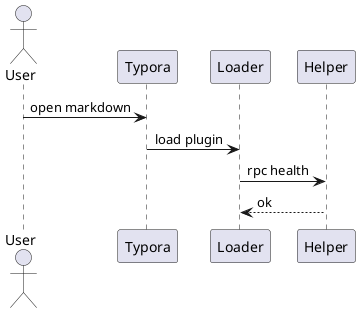

# 图形插件测试：markmap / plantUML / drawIO

## Markmap Fence

```markmap
---
markmap:
  height: 320px
  backgroundColor: "#ffffff"
---

# typora_plugin macOS

## Browser runtime
- loader.js
- entry.bundle.js
- shared-shims.js

## Helper
- random port
- bearer token
- path guard

## Plugins
- window_tab
- preferences
- command_palette
```

## PlantUML

> 注意：`plantUML` 默认请求 `http://localhost:8080`。没有本地 PlantUML server 时，这个块应该显示失败信息，用来测试错误提示是否清晰。



## DrawIO

> 注意：`drawIO` 默认依赖网络 viewer 和远程示例图。这个块用于测试网络资源加载、超时和错误展示。

```drawio
// ==BlockCodeConfig==
// @interaction      showOnly
// @height           auto
// @backgroundColor  transparent
// ==/BlockCodeConfig==

graphConfig = {
  source: "https://cdn.jsdelivr.net/gh/obgnail/typora_images@master/image/example.drawio",
  page: 0,
}
```
