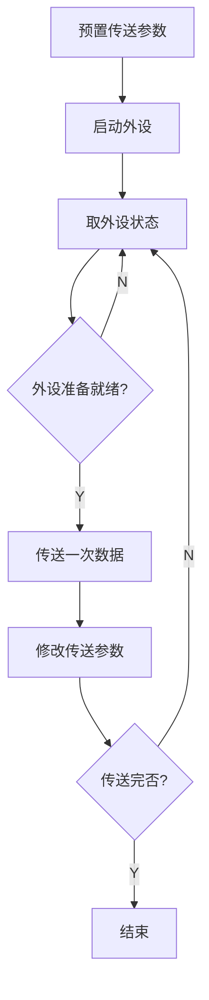

# 编辑增强测试：fence_enhance / markdownlint / md_padding

# 故意重复 H1，触发 markdownlint

这一段故意写成中文English混排,没有 spaces,用于测试 `md_padding` 的 `Ctrl+Shift+B`。

下面代码块用于测试 `fence_enhance` 的复制、缩进、折叠按钮。

```js
function buildStatus(items) {
  return items
    .filter(item => item.enabled)
    .map(item => ({
      name: item.name,
      status: item.ready ? "ready" : "pending",
    }));
}

const plugins = [
  { name: "window_tab", enabled: true, ready: true },
  { name: "markdownlint", enabled: true, ready: true },
  { name: "fence_enhance", enabled: true, ready: true },
  { name: "resource_manager", enabled: true, ready: false },
];

console.table(buildStatus(plugins));
```

## MarkdownLint 故意问题

- 这里有结尾空格    
- 这里下面故意多空行


  123 

​	124

<span style="letter-spacing:2pt;">    1231312412342</span>

<span style="letter-spacing:2pt;">123123 </span>

<span style="letter-spacing:2pt;">      </span>

<span style="letter-spacing:2pt;">   




1223</span>

<span style="letter-spacing:2pt;">   1233123 			  3234</span>

# <span style="letter-spacing:2pt;">1</span>

  1

​	1  

dsvdsv 问发热

##

2343647&&¥##

#¥

```
```


# <span styleletter-spacing:2pt;">2</spa

# <span style="letter-spacing:2pt;">3</span><span style=etter-spacg:11pt;"></span>


- 列表后面继续正文，观察 lint 提示。

## 行内样式

`md_padding` 应该保留 `:emoji_like:`、`<u>underline</u>`、`<span style="color:red">red</span>` 这些忽略模式。

# MarkdownLint 逆向压力测试

下面这些内容是故意写错的，用来确认 MarkdownLint 面板能显示规则名、行号、说明和可修复项。

#### MD001 跳级标题

这里从 H1 直接跳到 H4，应触发标题层级跳跃。

Setext 风格标题
---

### MD003 混用标题风格

#没有空格的标题

#   多个空格的标题

  ## MD023 缩进标题

## MD026 标题末尾有标点？

**MD036 只有加粗的一行，被当成标题**

---

***

* 无序列表用星号
+ 无序列表突然换加号
- 无序列表又换减号

1. 有序列表第一项
1. 有序列表第二项，编号故意不递增
3. 有序列表第三项

1.  列表 marker 后面两个空格
2.     列表 marker 后面五个空格

>  引用后面两个空格

> 引用第一段

> 引用第二段，中间故意空一行

这行后面有真实尾随空格    
这行中间有真实 Tab	用于触发 MD010


上面故意连续空了四行，超过 MD012 设置的 maximum = 3。

```bash
$ echo "命令前面不应该写美元符号"
```

```python
print("代码块前后没有空行时，观察 MD031")
```
下一行紧贴代码块。

列表前面没有空行
- MD032 列表前后缺空行
列表后面也没有空行

裸链接：http://example.com/markdownlint-bare-url


[空链接]()

## MD024 重复标题

## MD024 重复标题

普通段落直接贴着数学块：
$$
a^2 + b^2 = c^2
$$
普通段落继续贴着数学块，测试自定义 MD101。

## **MD102 整个标题都加粗**

行内数学 $x + y$ 和 $$x + y$$ 混用，测试自定义 MD103。
