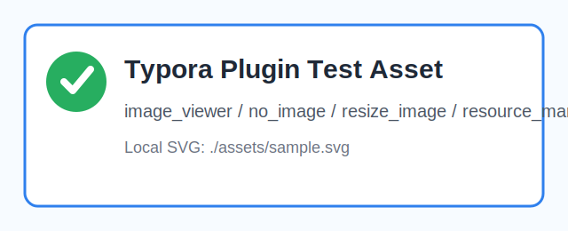

# 图片与资源测试：image_viewer / no_image / resize_image / resource_manager / asset_root_redirect

## 本地图片

## 远程图片

## 缺失图片

## 应测插件

| 插件 | 操作 | 期望 |
|---|---|---|
| image_viewer | 点击或触发图片查看 | 能预览本地/远程图片 |
| no_image | 通过右键菜单切换 | 图片隐藏/显示切换 |
| resize_image | 拖动图片或使用相关操作 | 图片尺寸可调整 |
| resource_manager | 打开资源管理器 | 能列出本文件引用的图片资源 |
| asset_root_redirect | 若启用 | 相对资源根路径可重定向 |

## 图片后正文

图片隐藏或缩放后，这段文字不应被遮挡。
