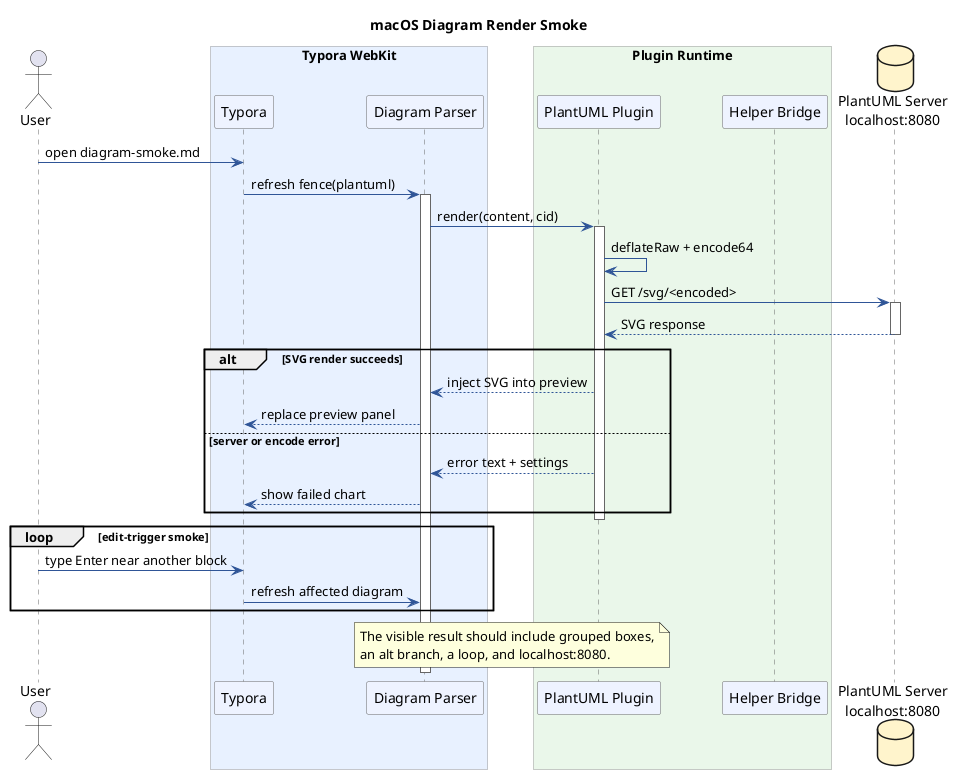

# Diagram Smoke

## DrawIO

```drawio
// ==BlockCodeConfig==
// @interaction      showOnly
// @height           auto
// @backgroundColor  transparent
// ==/BlockCodeConfig==

{
  page: 0,
  xml: `<mxfile host="app.diagrams.net">
  <diagram id="display-flow" name="Display Flow">
    <mxGraphModel dx="800" dy="420" grid="1" gridSize="10" guides="1" tooltips="1" connect="1" arrows="1" fold="1" page="1" pageScale="1" pageWidth="700" pageHeight="260" math="0" shadow="0">
      <root>
        <mxCell id="0"/>
        <mxCell id="1" parent="0"/>
        <mxCell id="typora" value="Typora" style="rounded=1;whiteSpace=wrap;html=1;fillColor=#dae8fc;strokeColor=#6c8ebf;" vertex="1" parent="1">
          <mxGeometry x="40" y="80" width="120" height="56" as="geometry"/>
        </mxCell>
        <mxCell id="loader" value="Loader" style="rounded=1;whiteSpace=wrap;html=1;fillColor=#d5e8d4;strokeColor=#82b366;" vertex="1" parent="1">
          <mxGeometry x="230" y="80" width="120" height="56" as="geometry"/>
        </mxCell>
        <mxCell id="helper" value="Helper RPC" style="rounded=1;whiteSpace=wrap;html=1;fillColor=#fff2cc;strokeColor=#d6b656;" vertex="1" parent="1">
          <mxGeometry x="420" y="80" width="120" height="56" as="geometry"/>
        </mxCell>
        <mxCell id="plugins" value="Plugins" style="rounded=1;whiteSpace=wrap;html=1;fillColor=#f8cecc;strokeColor=#b85450;" vertex="1" parent="1">
          <mxGeometry x="610" y="80" width="120" height="56" as="geometry"/>
        </mxCell>
        <mxCell id="edge-1" style="endArrow=block;html=1;rounded=0;strokeWidth=2;" edge="1" parent="1" source="typora" target="loader">
          <mxGeometry relative="1" as="geometry"/>
        </mxCell>
        <mxCell id="edge-2" style="endArrow=block;html=1;rounded=0;strokeWidth=2;" edge="1" parent="1" source="loader" target="helper">
          <mxGeometry relative="1" as="geometry"/>
        </mxCell>
        <mxCell id="edge-3" style="endArrow=block;html=1;rounded=0;strokeWidth=2;" edge="1" parent="1" source="helper" target="plugins">
          <mxGeometry relative="1" as="geometry"/>
        </mxCell>
      </root>
    </mxGraphModel>
  </diagram>
</mxfile>`,
}
```

## PlantUML



## Marp

```marp
---
theme: gaia
paginate: true
backgroundColor: #ffffff
color: #1f2937
header: macOS diagram smoke
footer: DrawIO / PlantUML / Marp
style: |
  section {
    box-sizing: border-box;
    padding: 64px 84px;
    font-family: "Avenir Next", "Helvetica Neue", Arial, sans-serif;
    overflow: hidden;
  }
  .columns {
    display: grid;
    grid-template-columns: 52% 40%;
    gap: 4%;
    align-items: start;
  }
  .badge {
    display: inline-block;
    margin-top: 32px;
    padding: 10px 20px;
    border-radius: 999px;
    background: #e8f1ff;
    color: #1d4ed8;
    font-size: 18px;
    font-weight: 700;
  }
  table {
    width: 100%;
    table-layout: fixed;
    font-size: 18px;
  }
  th,
  td {
    overflow-wrap: anywhere;
  }
---

<!-- _class: lead -->

# Marp Render Smoke

macOS WebKit + Shadow DOM

<span class="badge">revision: 2026-06-07</span>

---

## Rendering Path

<div class="columns">

<div>

1. Typora sees `marp`
2. Plugin loads `marp-core`
3. Markdown becomes slide DOM
4. CSS is isolated in shadow root

</div>

<div>

| Layer | Signal |
|---|---|
| Bundle | loaded |
| MathJax patch | ready |
| Images | absolute path |
| Shadow DOM | active |

</div>

</div>

---

<!-- _class: invert -->

## Visual Check

> If this page is visible, Marp is not showing raw Markdown.

- dark slide
- quote block
- numbered page footer
- custom CSS

---

## Regression Checklist

- [x] `marp-core` initialized
- [x] two or more slides rendered
- [x] CSS applied
- [x] content updates after editing

**Expected:** four distinct slides, not one plain code block.
```


```markmap
# Markmap 展示
## Runtime
- loader.js
- entry.bundle.js
- shared-shims.js
## Plugins
- window_tab
- image_viewer
- preferences
```

