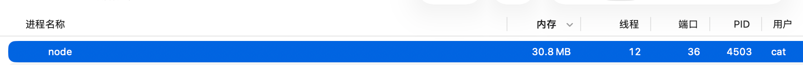
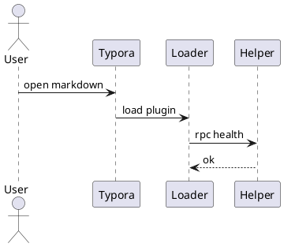

# Typora Plugin Display Samples

来源：`test/test.md` 的 58 个测试标题。每个小节都标出对应英文 fixedName 和入口 JS 文件；先给一段不开插件时只按普通 Markdown/普通界面看的内容，再给一段开启插件后应该能观察到效果的内容。

## 01. 标签页管理

- 英文名：`window_tab`
- JS 文件：`plugin/window_tab.js`

### 未开启效果

# Display Tab A

只打开一个 Typora 原生窗口时，这段标题只是普通标题；连续打开多个文件时，没有插件标签栏可用于快速切换。

### 开启后效果

# Display Tab B

同时打开 `test.md`、`display.md`、`README-cn.md`，顶部应出现插件标签栏。切换这些文件时，标签名、关闭按钮、重复标题处理都应该稳定显示。

## 02. 格式检查

- 英文名：`markdownlint`
- JS 文件：`plugin/markdownlint/index.js`

### 未开启效果

#格式检查未开启标题

这行后面故意留两个空格  

- 列表前后没有明显提示
普通段落紧贴列表。

### 开启后效果

#格式检查开启标题

这行后面故意留两个空格  

- 列表前后没有空行
普通段落紧贴列表。打开格式检查后，应能看到对应规则、行号、可修复项或提示面板。

## 03. 右侧大纲

- 英文名：`right_outline`
- JS 文件：`plugin/right_outline.js`

### 未开启效果

## 右侧大纲普通一级

### 右侧大纲普通二级

#### 右侧大纲普通三级

这些标题只在正文中显示，右侧没有插件增强的大纲面板。

### 开启后效果

## 右侧大纲增强一级

### 右侧大纲增强二级

#### 右侧大纲增强三级

开启后右侧应显示标题树；移动光标、滚动正文时，大纲高亮应同步变化。

## 04. 多元文字搜索

- 英文名：`search_multi`
- JS 文件：`plugin/search_multi/index.js`

### 未开启效果

搜索样本文本：`TP_DISPLAY_SEARCH_ALPHA`、`TP_DISPLAY_SEARCH_BETA`、`helper-token-path-guard`。

### 开启后效果

打开多元搜索，搜索 `TP_DISPLAY_SEARCH_ALPHA`。结果应定位到本文件这一行，并在正文中高亮命中词：TP_DISPLAY_SEARCH_ALPHA。

## 05. 只读模式

- 英文名：`read_only`
- JS 文件：`plugin/read_only.js`

### 未开启效果

这句话可以被直接选中、删除、输入新文字，复选框也可以点击：- [ ] 未开启只读模式。

### 开启后效果

开启只读模式后，尝试修改这一句、勾选下面任务项或粘贴文本，应被阻止或明显受限：- [ ] 只读模式测试项。

## 06. 夜间模式

- 英文名：`dark`
- JS 文件：`plugin/dark.js`

### 未开启效果

浅色页面下，这段文字、表格和代码块使用 Typora 当前默认配色。

| 区域 | 颜色观察 |
|---|---|
| 正文 | 浅色背景 |
| 表格 | 默认边框 |

### 开启后效果

开启夜间模式后，同样的正文和表格应切到暗色视觉，代码块、链接、表格边框仍应可读。

```js
console.log("dark mode color contrast");
```

## 07. 无图模式

- 英文名：`no_image`
- JS 文件：`plugin/no_image.js`

### 未开启效果


图片正常显示，下面这段文字紧跟在图片后面。

### 开启后效果


开启无图模式后，图片应隐藏或显示占位信息，正文排版不应被图片撑开。

## 08. 模糊模式

- 英文名：`blur`
- JS 文件：`plugin/blur.js`

### 未开启效果

第一段：未开启时，所有段落都清晰可见。

第二段：移动鼠标或光标不会改变其他段落清晰度。

### 开启后效果

第一段：开启模糊模式后，当前聚焦区域应保持清晰。

第二段：非当前区域应出现模糊或弱化效果，用来观察阅读聚焦。

## 09. 命令行环境

- 英文名：`commander`
- JS 文件：`plugin/commander.js`

### 未开启效果

下面只是普通命令文本，不会弹出命令行面板：

`pwd`

### 开启后效果

打开命令行环境后，可输入这些命令观察输出：

```bash
pwd
ls test
echo typora-plugin-display
```

## 10. 命令面板

- 英文名：`command_palette`
- JS 文件：`plugin/command_palette.js`

### 未开启效果

这些关键词只是普通文本：`markdownlint`、`image_viewer`、`resource_manager`、`preferences`。

### 开启后效果

按 `Ctrl+Shift+P` 打开命令面板，依次搜索 `markdownlint`、`image_viewer`、`resource_manager`、`preferences`，应能看到匹配命令并执行。

## 11. 中英文混排优化

- 英文名：`md_padding`
- JS 文件：`plugin/md_padding/index.js`

### 未开启效果

这是一段中文 English 混排文字, 包含 TyporaPlugin2026 和 OpenAI 模型, 逗号后面也故意不加 space。

### 开启后效果

对上一段或这一段执行中英文混排优化后，应变成中文、English、数字之间带合适空格：这是一段中文 English 混排文字, 包含 TyporaPlugin2026 和 OpenAI 模型。

## 12. 标记常显

- 英文名：`static_markers`
- JS 文件：`plugin/static_markers.js`

### 未开启效果

这段包含 **加粗**、*斜体*、`行内代码`、[链接](https://github.com/obgnail/typora_plugin)，Typora 通常会隐藏部分 Markdown 标记。

### 开启后效果

开启标记常显后，这段里的 `**`、`*`、反引号、链接括号等 Markdown 标记应更稳定地显示出来：**加粗**、*斜体*、`code`、[link](https://github.com/obgnail/typora_plugin)。

## 13. 离焦视力舒缓

- 英文名：`myopic_defocus`
- JS 文件：`plugin/myopic_defocus.js`

### 未开启效果

这一行普通显示。

这一行普通显示。

这一行普通显示。

### 开启后效果

开启离焦视力舒缓后，当前阅读附近保持清楚，远离焦点的行应逐渐弱化，移动光标可以观察变化。

## 14. 图片放缩

- 英文名：`resize_image`
- JS 文件：`plugin/resize_image.js`

### 未开启效果


图片按原始或 Typora 默认尺寸显示。

### 开启后效果


开启后选中或拖动图片，应能调整显示尺寸，并保留新的宽高信息。

## 15. 表格放缩

- 英文名：`resize_table`
- JS 文件：`plugin/resize_table.js`

### 未开启效果

| 列 A | 列 B | 列 C | 列 D |
|---|---|---|---|
| 普通表格 | 默认列宽 | 较长内容用于撑开列宽 | 观察是否可拖动 |

### 开启后效果

| 列 A | 列 B | 列 C | 列 D |
|---|---|---|---|
| 开启表格放缩后 | 拖动列边界 | 应可调整列宽 | 表格不应错位 |

## 16. DataTables

- 英文名：`datatables`
- JS 文件：`plugin/datatables/index.js`

### 未开启效果

| 名称 | 类型 | 状态 | 优先级 | 最近检查 |
|---|---|---|---|---|
| window_tab | core | ok | P0 | 2026-06-08 |
| markdownlint | edit | warning | P1 | 2026-06-08 |
| image_viewer | visual | ok | P1 | 2026-06-07 |
| markmap | diagram | ok | P1 | 2026-06-08 |
| datatables | table | review | P2 | 2026-06-08 |

### 开启后效果

| 名称 | 类型 | 状态 | 优先级 | 负责人 | 最近检查 | 备注 |
|---|---|---|---|---|---|---|
| window_tab | core | ok | P0 | Cat | 2026-06-08 | 标签切换和拖拽排序 |
| markdownlint | edit | warning | P1 | Cat | 2026-06-08 | 规则面板与自动修复 |
| image_viewer | visual | ok | P1 | Cat | 2026-06-07 | 看图模式和缩略图 |
| markmap | diagram | ok | P1 | Cat | 2026-06-08 | fence 与大纲思维导图 |
| datatables | table | review | P2 | Cat | 2026-06-08 | 搜索、排序、分页 |
| plantUML | diagram | ok | P1 | Cat | 2026-06-07 | 本地渲染器 |
| drawIO | diagram | ok | P1 | Cat | 2026-06-07 | XML 图表渲染 |
| marp | slide | ok | P1 | Cat | 2026-06-07 | 幻灯片缩放显示 |
| echarts | chart | ok | P2 | Cat | 2026-06-07 | 柱状图和主题 |
| chart | chart | ok | P2 | Cat | 2026-06-07 | Chart.js 折线图 |
| wavedrom | diagram | ok | P2 | Cat | 2026-06-07 | 时序图 |
| calendar | calendar | ok | P2 | Cat | 2026-06-07 | 周视图日程 |
| abc | music | ok | P3 | Cat | 2026-06-07 | ABC 乐谱 |
| callouts | edit | ok | P2 | Cat | 2026-06-08 | NOTE/WARNING/SUCCESS |
| collapse_paragraph | fold | ok | P1 | Cat | 2026-06-08 | 章节折叠 |
| collapse_list | fold | unknown | P3 | Cat | 2026-06-06 | 嵌套列表折叠待复测 |
| collapse_table | fold | unknown | P3 | Cat | 2026-06-06 | 表格折叠待复测 |
| resize_table | table | ok | P2 | Cat | 2026-06-06 | 拖动列宽 |
| resize_image | visual | ok | P2 | Cat | 2026-06-06 | 图片宽高调整 |
| no_image | visual | ok | P3 | Cat | 2026-06-06 | 图片隐藏占位 |
| dark | theme | ok | P0 | Cat | 2026-06-08 | 全局夜间模式 |
| preferences | settings | ok | P0 | Cat | 2026-06-08 | 通用设置和专属设置 |
| command_palette | command | ok | P1 | Cat | 2026-06-08 | 命令搜索与执行 |
| commander | command | warning | P2 | Cat | 2026-06-06 | shell 兼容待观察 |
| hotkeys | command | ok | P2 | Cat | 2026-06-06 | 快捷键清单 |
| right_click_menu | menu | ok | P1 | Cat | 2026-06-06 | 插件分组菜单 |
| action_buttons | menu | ok | P2 | Cat | 2026-06-08 | 右侧悬浮按钮 |
| right_outline | outline | ok | P2 | Cat | 2026-06-06 | 右侧标题树 |
| search_multi | search | ok | P2 | Cat | 2026-06-06 | 多关键词搜索 |
| ripgrep | search | warning | P2 | Cat | 2026-06-06 | 本地 rg 搜索 |
| resource_manager | asset | warning | P2 | Cat | 2026-06-06 | 缺失资源扫描 |
| export_enhance | export | unknown | P3 | Cat | 2026-06-06 | 导出链路待复测 |

开启 DataTables 后，右键表格选择“增强表格”，应能看到搜索框、每页条数、列排序、列筛选下拉框和分页信息；可以搜索 `diagram`、按“状态”排序，或在“类型”列筛选 `chart`。

## 17. Markmap

- 英文名：`markmap`
- JS 文件：`plugin/markmap/index.js`

### 未开启效果

# Markmap 普通大纲

## Runtime

- loader
- bundle
- helper

### 开启后效果

```markmap
# Markmap 展示
## Runtime
- loader.js
- entry.bundle.js
- shared-shims.js
## Plugins
- window_tab
- image_viewer
- preferences
```

## 18. 自动编号

- 英文名：`auto_number`
- JS 文件：`plugin/auto_number.js`

### 未开启效果

## 自动编号普通标题

| 项目 | 状态 |
|---|---|
| 表格编号候选 | ok |


### 开启后效果

## 自动编号增强标题

| 项目 | 状态 |
|---|---|
| 表格编号候选 | ok |


开启后标题、表格、图片、代码块等应出现自动编号或编号相关提示。

## 19. 代码块增强

- 英文名：`fence_enhance`
- JS 文件：`plugin/fence_enhance/index.js`

### 未开启效果

```js
const plugins = ["window_tab", "fence_enhance", "markdownlint"];
console.log(plugins.join(", "));
```

### 开启后效果

```js
function displayFenceEnhance(items) {
  return items.map(item => ({ name: item, enabled: true }));
}

console.table(displayFenceEnhance(["copy", "fold", "indent", "highlight"]));
```

开启后代码块旁应有复制、折叠、缩进或增强按钮。

## 20. 章节折叠

- 英文名：`collapse_paragraph`
- JS 文件：`plugin/collapse_paragraph.js`

### 未开启效果

## 可折叠章节 A

这一段只是普通正文。

### 子章节 A-1

这一段会跟随标题显示。

### 开启后效果

## 可折叠章节 B

开启章节折叠后，标题旁应出现折叠控制；折叠后本段正文隐藏。

### 子章节 B-1

子章节也应参与折叠层级。

## 21. 列表折叠

- 英文名：`collapse_list`
- JS 文件：`plugin/collapse_list.js`

### 未开启效果

- 项目 A
  - A.1
  - A.2
    - A.2.a
- 项目 B

### 开启后效果

- 项目 A
  - A.1
  - A.2
    - A.2.a
- 项目 B

开启后嵌套列表旁应出现折叠控制，折叠父级后子项隐藏。

## 22. 表格折叠

- 英文名：`collapse_table`
- JS 文件：`plugin/collapse_table.js`

### 未开启效果

| 模块 | 描述 |
|---|---|
| collapse_table | 普通表格全部展开 |
| row 2 | 继续显示 |

### 开启后效果

| 模块 | 描述 |
|---|---|
| collapse_table | 开启后应能折叠表格 |
| row 2 | 折叠后隐藏正文区域 |

## 23. 图片查看

- 英文名：`image_viewer`
- JS 文件：`plugin/image_viewer.js`

### 未开启效果




图片只作为普通图片显示。

### 开启后效果


触发图片查看后，应进入看图模式，并看到完整缩略图列表。

## 24. 文段截断

- 英文名：`truncate_text`
- JS 文件：`plugin/truncate_text.js`

### 未开启效果

这是一段很长很长的文字，用来观察未开启文段截断时的完整显示。它应该连续占据多行，不会自动收起，不会出现展开按钮，也不会隐藏后半部分。继续补充一些文字，让这一段足够长：alpha beta gamma delta epsilon zeta eta theta iota kappa lambda mu。

### 开启后效果

这是一段很长很长的文字，用来观察开启文段截断后的效果。开启后，超出配置长度的部分应被折叠或隐藏，并提供展开全部的操作入口。继续补充一些文字，让这一段足够长：alpha beta gamma delta epsilon zeta eta theta iota kappa lambda mu。

## 25. 导出增强

- 英文名：`export_enhance`
- JS 文件：`plugin/export_enhance.js`

### 未开启效果

普通导出内容：一段文字、一个链接、一个图片。

[Typora Plugin](https://github.com/obgnail/typora_plugin)


### 开启后效果

开启导出增强后，导出同样内容时，应能处理远程资源、图片路径或增强导出选项。

[Typora Plugin](https://github.com/obgnail/typora_plugin)


## 26. 侧边栏增强

- 英文名：`sidebar_enhance`
- JS 文件：`plugin/sidebar_enhance.js`

### 未开启效果

在左侧文件树中打开 `test/`，普通侧边栏只显示文件和目录。

### 开启后效果

开启后在左侧文件树观察 `test/`：应出现文件计数、扩展信息或增强操作。本文档用于制造可见文件：`display.md`。

## 27. 文字风格化

- 英文名：`text_stylize`
- JS 文件：`plugin/text_stylize.js`

### 未开启效果

选中这段文字时，只能使用 Typora 原生命令调整样式：需要加粗、颜色、下划线、删除线、上标、下标。

### 开启后效果

选中这段文字，打开文字风格化工具，应能应用颜色、背景色、字体、格式刷、清除格式等效果：Typora Plugin Style Sample。

## 28. 加密文件

- 英文名：`cipher`
- JS 文件：`plugin/cipher/index.js`

### 未开启效果

机密样本文字：API_TOKEN = display-secret-token-123。未开启加密时，这段内容以明文保存在 Markdown 中。

### 开启后效果

开启加密文件后，对本段或当前文件执行加密操作，应生成不可直接阅读的密文；解密后应恢复：API_TOKEN = display-secret-token-123。

## 29. 编辑工具

- 英文名：`easy_modify`
- JS 文件：`plugin/easy_modify.js`

### 未开启效果

这一段用于复制路径、复制标题路径、插入时间、大小写转换等编辑工具测试。

### 开启后效果

选中 `easy modify sample text`，通过编辑工具执行大小写转换、复制路径或插入时间，应看到正文或剪贴板变化。

## 30. 二级插件

- 英文名：`custom`
- JS 文件：`plugin/custom/index.js`

### 未开启效果

这段文字只是普通右键区域；没有二级插件菜单时，右键不会看到自定义动作。

### 开启后效果

在这段文字或下面标题上右键，`二级插件` 分组应出现已配置的 custom 插件动作。

### Custom Action Anchor

## 31. 悬浮动作按钮

- 英文名：`action_buttons`
- JS 文件：`plugin/action_buttons.js`

### 未开启效果

滚动页面时，正文旁不会出现额外悬浮按钮。

### 开启后效果

滚动到本段附近，应能看到悬浮动作按钮；点击按钮应触发返回顶部、菜单或配置里定义的动作。

## 32. 鼠标手势

- 英文名：`mouse_gestures`
- JS 文件：`plugin/mouse_gestures.js`

### 未开启效果

按住鼠标右键移动时，只会出现普通右键菜单或系统行为。

### 开启后效果

开启鼠标手势后，在这段区域按配置手势移动，应出现轨迹或触发返回、关闭、滚动等动作。

## 33. 斜杠命令

- 英文名：`slash_commands`
- JS 文件：`plugin/slash_commands.js`

### 未开启效果

在下一行输入 `/` 时，它只是普通字符：

/

### 开启后效果

在下一行末尾输入 `/` 或 `\`，应弹出斜杠命令候选菜单，可插入标题、表格、代码块或插件动作：

/

## 34. 中文符号配对

- 英文名：`cjk_symbol_pairing`
- JS 文件：`plugin/cjk_symbol_pairing.js`

### 未开启效果

输入中文符号时需要手动补全：书名号、括号、引号、方括号。

### 开启后效果

在这行后面输入中文左符号，观察是否自动补全右符号： 「 （ 【 “ 《

## 35. 右键菜单

- 英文名：`right_click_menu`
- JS 文件：`plugin/right_click_menu.js`

### 未开启效果

在这段文字上右键，只会看到 Typora 或系统原生菜单。

### 开启后效果

在这段文字上右键，应看到插件分组菜单：可视化插件、编辑插件、组件插件、交互插件。

## 36. 圆盘菜单

- 英文名：`pie_menu`
- JS 文件：`plugin/pie_menu.js`

### 未开启效果

鼠标中键或 Ctrl+右键只触发普通系统/Typora 行为。

### 开启后效果

在这段文字附近触发圆盘菜单，应该看到环形按钮组；旋转或点击不同区域应执行对应动作。

## 37. 插件配置

- 英文名：`preferences`
- JS 文件：`plugin/preferences/index.js`

### 未开启效果

这些配置名只是普通文本：`image_viewer.SKIP_BROKEN_IMAGES`、`window_tab.TAB_MAX_WIDTH`、`dark.ENABLE`。

### 开启后效果

打开插件配置，搜索 `image_viewer`、`window_tab`、`dark`，应能看到对应配置项并修改保存。

## 38. 快捷键中心

- 英文名：`hotkeys`
- JS 文件：`plugin/hotkeys.js`

### 未开启效果

快捷键清单只是普通文本：`Ctrl+Shift+P`、`Ctrl+Shift+B`、`Ctrl+Alt+F`。

### 开启后效果

打开快捷键中心，应列出这些插件热键，并能查看冲突或对应动作：`command_palette`、`md_padding`、`search_multi`。

## 39. 资源管理

- 英文名：`resource_manager`
- JS 文件：`plugin/resource_manager.js`

### 未开启效果


未开启时，只能人工检查哪些资源被引用、哪些缺失。

### 开启后效果

打开资源管理器，应能扫描本文档引用的图片，列出已使用、缺失或未使用资源。

## 40. 资源重定向

- 英文名：`asset_root_redirect`
- JS 文件：`plugin/asset_root_redirect.js`

### 未开启效果


资源路径按当前 Markdown 文件所在目录解析。

### 开启后效果

配置资源根目录后，相对资源应按重定向根路径解析。用这张图观察路径是否仍能正确显示：


## 41. 书签管理

- 英文名：`bookmark`
- JS 文件：`plugin/bookmark.js`

### 未开启效果

## Bookmark Display Point A

这只是普通标题，不能通过插件书签面板快速返回。

### 开启后效果

## Bookmark Display Point B

给这个标题或段落添加书签后，打开书签管理器应能看到它，并点击跳回本处。

## 42. 文件模板

- 英文名：`templater`
- JS 文件：`plugin/templater.js`

### 未开启效果

模板变量只是一段普通文本，不会替换：

`title={{title}} date={{date}} uuid={{uuid}}`

### 开启后效果

通过文件模板创建新文件时，下面变量应在预览或生成文件中被替换：

```md
---
title: {{title}}
date: {{date}}
uuid: {{uuid}}
---
```

## 43. 写作区宽度调整

- 英文名：`editor_width_slider`
- JS 文件：`plugin/editor_width_slider.js`

### 未开启效果

这是一段用来观察写作区宽度的长文本。未开启时，写作区宽度由 Typora 原设置控制，无法通过插件滑块快速调整。

### 开启后效果

开启写作区宽度调整后，拖动宽度滑块，应看到这一段文本的换行位置随写作区宽度变化。

## 44. 文章上传

- 英文名：`article_uploader`
- JS 文件：`plugin/article_uploader/index.js`

### 未开启效果

---
title: Display Upload Sample
tags: [typora-plugin, display]
---

这只是普通文章元信息，不会上传到任何平台。

### 开启后效果

打开文章上传后，使用当前文档或这段元信息测试上传流程；未配置平台时应给出清晰错误提示，不应静默失败。

## 45. Ripgrep

- 英文名：`ripgrep`
- JS 文件：`plugin/ripgrep.js`

### 未开启效果

关键词只是普通正文：TP_DISPLAY_RG_ALPHA、TP_DISPLAY_RG_BETA、TP_DISPLAY_RG_GAMMA。

### 开启后效果

打开 Ripgrep 面板，输入下面命令，应在输出里找到本文件：

```bash
TP_DISPLAY_RG_ALPHA test/display.md
```

## 46. 光标历史

- 英文名：`cursor_history`
- JS 文件：`plugin/cursor_history.js`

### 未开启效果

## Cursor Point One

移动到这里后，再移动到别处，无法通过插件光标历史跳回。

### 开启后效果

## Cursor Point Two

在多个标题间移动光标后，执行光标后退/前进热键，应能在这些位置之间跳转。

## 47. 远程控制

- 英文名：`remote_control`
- JS 文件：`plugin/remote_control/index.js`

### 未开启效果

远程控制请求只是普通文本：

```json
{"jsonrpc":"2.0","method":"document.getContent","id":1}
```

### 开启后效果

开启远程控制后，外部客户端应能通过配置的 RPC 接口读取路径、内容或执行允许的操作；未授权请求应被拒绝。

## 48. 升级插件

- 英文名：`updater`
- JS 文件：`plugin/updater.js`

### 未开启效果

版本检查文字只是普通说明：current version -> latest version。

### 开启后效果

打开升级插件动作，应能检查版本、展示更新信息，并在失败时显示网络或权限错误。

## 49. Timeline

- 英文名：`timeline`
- JS 文件：`plugin/timeline.js`

### 未开启效果

# 普通时间线文本

## 2026-06-07

- 编写 display.md
- 检查插件映射

### 开启后效果

```timeline
# Display Timeline

## 2026-06-07
### 生成展示文档
- 从 test.md 提取标题
- 映射 fixedName 和 JS 文件
## 2026-06-08
### 测试更多功能
-吃饭
-睡觉
-吃饭
-睡觉

---
同一段内容应渲染为时间线组件。
```

## 50. ECharts

- 英文名：`echarts`
- JS 文件：`plugin/echarts/index.js`

### 未开启效果

| 阶段 | 数量 |
|---|---:|
| 映射 | 58 |
| 写入 | 1 |
| 校验 | 3 |

### 开启后效果

```echarts
// ==BlockCodeConfig==
// @locale           zh
// @theme            light
// @renderer         svg
// @height           300px
// @backgroundColor  transparent
// ==/BlockCodeConfig==

option = {
  title: { text: 'Display 文档进度' },
  tooltip: {},
  xAxis: { data: ['映射', '写入', '校验'] },
  yAxis: {},
  series: [{ type: 'bar', data: [58, 99, 30] }]
}
```

## 51. Chart

- 英文名：`chart`
- JS 文件：`plugin/chart/index.js`

### 未开启效果

普通折线数据：启动 1、加载 3、渲染 5、验证 8。

### 开启后效果

```chart
// ==BlockCodeConfig==
// @align            center
// @height           300px
// @backgroundColor  transparent
// ==/BlockCodeConfig==

config = {
  type: "line",
  data: {
    labels: ["启动", "加载", "渲染", "验证"],
    datasets: [{
      label: "display sample",
      data: [1, 3, 5, 8],
      borderColor: "rgb(75, 192, 192)",
      tension: 0.25
    }]
  }
}
```

## 52. WaveDrom

- 英文名：`wavedrom`
- JS 文件：`plugin/wavedrom/index.js`

### 未开启效果

普通时序说明：open -> load -> ready。

### 开启后效果

```wavedrom
// ==BlockCodeConfig==
// @align            center
// @height           auto
// @backgroundColor  transparent
// ==/BlockCodeConfig==

{
  "signal": [
    { "name": "open",  "wave": "p......." },
    { "name": "load",  "wave": "0.1.0..." },
    { "name": "ready", "wave": "0...1..." }
  ],
  "config": { "hscale": 1.3 }
}
```

## 53. Calendar

- 英文名：`calendar`
- JS 文件：`plugin/calendar/index.js`

### 未开启效果

普通日程列表：

- 周一：梳理插件清单、补齐展示文档
- 周二：测试图表渲染、检查 WaveDrom 与 Calendar
- 周三：核对 macOS bundle、处理资源路径
- 周四：验证快捷键、右键菜单和命令面板
- 周五：整理截图、记录测试结果
- 周六：回归交互组件、复测边界场景
- 周日：总结问题、准备下一轮测试

### 开启后效果

```calendar
// ==BlockCodeConfig==
// @height           720px
// @backgroundColor  transparent
// ==/BlockCodeConfig==

const today = new Date()
const weekStart = new Date(today)
weekStart.setHours(0, 0, 0, 0)
weekStart.setDate(today.getDate() - ((today.getDay() + 6) % 7))

const at = (day, hour, minute = 0) => {
  const date = new Date(weekStart)
  date.setDate(weekStart.getDate() + day)
  date.setHours(hour, minute, 0, 0)
  return date
}

const event = (id, day, start, end, title, calendarId = 'test') => ({
  id,
  calendarId,
  title,
  category: 'time',
  start: at(day, ...start),
  end: at(day, ...end),
})

calendar.setDate(weekStart)
calendar.setCalendars([
  { id: 'doc', name: '文档整理', backgroundColor: '#2f80ed', borderColor: '#2f80ed' },
  { id: 'test', name: '功能测试', backgroundColor: '#27ae60', borderColor: '#27ae60' },
  { id: 'review', name: '复盘检查', backgroundColor: '#f2994a', borderColor: '#f2994a' },
])

option = {
  defaultView: 'week',
  week: {
    startDayOfWeek: 1,
    hourStart: 8,
    hourEnd: 21,
    taskView: true,
    eventView: true,
  },
}

calendar.createEvents([
  { id: 'week-plan', calendarId: 'doc', title: '一周测试计划', category: 'allday', start: at(0, 0), end: at(7, 0) },
  event('mon-1', 0, [9, 0], [10, 30], '梳理插件清单', 'doc'),
  event('mon-2', 0, [14, 0], [16, 0], '补齐 display.md 示例', 'doc'),
  event('tue-1', 1, [9, 30], [11, 0], 'ECharts / Chart 回归', 'test'),
  event('tue-2', 1, [15, 0], [17, 30], 'WaveDrom 与 Calendar 验证', 'test'),
  event('wed-1', 2, [10, 0], [12, 0], '检查 macOS bundle 注册表', 'review'),
  event('wed-2', 2, [16, 0], [18, 0], '资源路径与导出检查', 'review'),
  event('thu-1', 3, [9, 0], [10, 0], '快捷键中心巡检', 'test'),
  event('thu-2', 3, [13, 30], [15, 30], '右键菜单与命令面板', 'test'),
  event('fri-1', 4, [10, 0], [11, 30], '截图整理', 'doc'),
  event('fri-2', 4, [14, 0], [16, 30], '记录测试结果', 'doc'),
  event('sat-1', 5, [9, 30], [12, 0], '交互组件回归', 'test'),
  event('sat-2', 5, [15, 0], [18, 0], '边界场景复测', 'review'),
  event('sun-1', 6, [10, 0], [12, 0], '问题总结', 'review'),
  event('sun-2', 6, [14, 30], [17, 0], '准备下一轮测试', 'doc'),
])
```

## 54. ABC

- 英文名：`abc`
- JS 文件：`plugin/abc/index.js`

### 未开启效果

ABC 记谱法是纯文本乐谱；未开启插件时，下面这些音符、拍号、调号和声部声明只会作为普通文本显示：

X:1 / T:Display Tune / M:4/4 / K:C / C D E F | G A B c

### 开启后效果

```abc
X:1
T:Display Tune - ABC Notation Demo
C:Typora Plugin
M:4/4
L:1/8
Q:1/4=112
K:C
%%score {Melody | Bass}
V:Melody clef=treble name="Melody"
V:Bass clef=bass name="Bass"
[V:Melody] "C"C2 D2 E2 G2 | "F"A2 G2 E2 C2 | "G"D2 E2 G2 B2 | "C"c4 G4 |
[V:Bass]   C,2 G,2 E,2 G,2 | F,2 C2 A,2 C2 | G,2 D2 B,2 D2 | C,4 C,4 |
[V:Melody] "Am"A2 c2 B2 A2 | "Dm"F2 A2 G2 F2 | "G"E2 G2 F2 D2 | "C"C4 z4 ||
[V:Bass]   A,,2 E,2 C2 E2 | D,2 A,2 F2 A,2 | G,2 D2 B,2 D2 | C,4 z4 ||
```

开启后应渲染出标题、速度、拍号、调号、和弦标记，以及 Melody/Bass 两条五线谱声部。

## 55. DrawIO

- 英文名：`drawIO`
- JS 文件：`plugin/drawIO.js`

### 未开启效果

普通流程文本：Typora -> Loader -> Helper -> Plugins。

### 开启后效果

```drawio
// ==BlockCodeConfig==
// @interaction      showOnly
// @height           auto
// @backgroundColor  transparent
// ==/BlockCodeConfig==

{
  page: 0,
  xml: `<mxfile host="app.diagrams.net">
  <diagram id="display-flow" name="Display Flow">
    <mxGraphModel dx="800" dy="420" grid="1" gridSize="10" guides="1" tooltips="1" connect="1" arrows="1" fold="1" page="1" pageScale="1" pageWidth="700" pageHeight="260" math="0" shadow="0">
      <root>
        <mxCell id="0"/>
        <mxCell id="1" parent="0"/>
        <mxCell id="typora" value="Typora" style="rounded=1;whiteSpace=wrap;html=1;fillColor=#dae8fc;strokeColor=#6c8ebf;" vertex="1" parent="1">
          <mxGeometry x="40" y="80" width="120" height="56" as="geometry"/>
        </mxCell>
        <mxCell id="loader" value="Loader" style="rounded=1;whiteSpace=wrap;html=1;fillColor=#d5e8d4;strokeColor=#82b366;" vertex="1" parent="1">
          <mxGeometry x="230" y="80" width="120" height="56" as="geometry"/>
        </mxCell>
        <mxCell id="helper" value="Helper RPC" style="rounded=1;whiteSpace=wrap;html=1;fillColor=#fff2cc;strokeColor=#d6b656;" vertex="1" parent="1">
          <mxGeometry x="420" y="80" width="120" height="56" as="geometry"/>
        </mxCell>
        <mxCell id="plugins" value="Plugins" style="rounded=1;whiteSpace=wrap;html=1;fillColor=#f8cecc;strokeColor=#b85450;" vertex="1" parent="1">
          <mxGeometry x="610" y="80" width="120" height="56" as="geometry"/>
        </mxCell>
        <mxCell id="edge-1" style="endArrow=block;html=1;rounded=0;strokeWidth=2;" edge="1" parent="1" source="typora" target="loader">
          <mxGeometry relative="1" as="geometry"/>
        </mxCell>
        <mxCell id="edge-2" style="endArrow=block;html=1;rounded=0;strokeWidth=2;" edge="1" parent="1" source="loader" target="helper">
          <mxGeometry relative="1" as="geometry"/>
        </mxCell>
        <mxCell id="edge-3" style="endArrow=block;html=1;rounded=0;strokeWidth=2;" edge="1" parent="1" source="helper" target="plugins">
          <mxGeometry relative="1" as="geometry"/>
        </mxCell>
      </root>
    </mxGraphModel>
  </diagram>
</mxfile>`,
}
```

## 56. PlantUML

- 英文名：`plantUML`
- JS 文件：`plugin/plantUML.js`

### 未开启效果

普通序列图文字：User asks Typora to load plugin, Typora calls Helper, Helper returns ok。

### 开启后效果



## 57. Marp

- 英文名：`marp`
- JS 文件：`plugin/marp/index.js`

### 未开启效果

# 普通幻灯片文本

第一页标题

---

第二页标题

### 开启后效果

```marp
---
theme: gaia
paginate: true
backgroundColor: #FFFFFF
---

# Typora Plugin Display

macOS smoke sample

---

## Checklist

- test.md titles
- fixedName mapping
- JS entry path
```

## 58. Callouts

- 英文名：`callouts`
- JS 文件：`plugin/callouts.

### 开启后效果

> [!NOTE]
> NOTE 类型：普通说明块。

> [!WARNING]
> WARNING 类型：警告块。

> [!SUCCESS]
> SUCCESS 类型：成功状态。
